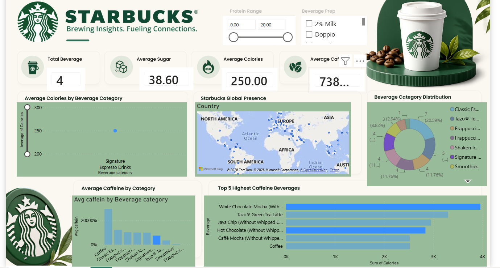

# -Starbucks-Beverage-Analytics-Dashboard


# ☕ Starbucks Beverage Analytics Dashboard


---

## 📌 Project Overview

The Starbucks Beverage Analytics Dashboard is an interactive Power BI solution designed to analyze Starbucks beverage nutritional information, category performance, caffeine content, calorie distribution, and global presence.

The dashboard transforms raw beverage data into actionable insights, enabling better understanding of product composition, nutritional trends, and category-level performance.

---

## 🎯 Business Objective

The primary objectives of this dashboard are to:

- Analyze beverage nutritional information.
- Compare beverage categories.
- Track caffeine, calorie, sugar, and protein metrics.
- Identify high-caffeine beverages.
- Visualize Starbucks' global presence.
- Support data-driven decision-making through business intelligence.

---

## 📷 Dashboard Preview



---

## 📊 Key Performance Indicators (KPIs)

| KPI | Description |
|------|------------|
| Total Beverage Categories | Total beverage categories available |
| Average Sugar | Average sugar content across beverages |
| Average Calories | Average calories across beverages |
| Average Caffeine | Average caffeine content across beverages |

---

## 📈 Dashboard Features

### 🔹 Beverage Category Analysis

Analyze major beverage categories including:

- Classic Espresso Drinks
- Signature Espresso Drinks
- Frappuccino Blended Beverages
- Coffee
- Smoothies
- Tazo® Tea Drinks
- Shaken Iced Beverages

**Insights Generated:**
- Category-wise distribution
- Product comparison
- Nutritional evaluation

---

### 🔹 Average Calories by Beverage Category

Provides category-level calorie analysis to identify:

- High-calorie beverages
- Low-calorie options
- Nutritional trends

---

### 🔹 Average Caffeine by Beverage Category

Evaluates caffeine concentration across beverage categories.

**Business Benefits:**
- Consumer preference analysis
- Product positioning
- Nutritional benchmarking

---

### 🔹 Top 5 Highest Caffeine Beverages

Highlights beverages with the highest caffeine content.

Examples:

- White Chocolate Mocha
- Tazo® Green Tea Latte
- Java Chip
- Hot Chocolate
- Caffè Mocha

---

### 🔹 Beverage Category Distribution

Interactive donut chart displaying:

- Product category contribution
- Beverage distribution
- Category popularity

---

### 🔹 Starbucks Global Presence

Interactive geographical map showcasing Starbucks locations worldwide.

**Benefits:**
- Global footprint visualization
- Market presence analysis
- Regional insights

---

## 📊 Key Insights

### Nutritional Insights

- Beverage categories vary significantly in calorie and caffeine content.
- Certain categories contribute disproportionately to overall caffeine intake.

### Product Insights

- High-caffeine beverages dominate specific product categories.
- Product distribution varies across beverage groups.

### Business Insights

- Starbucks maintains a strong international footprint.
- Product diversification supports a broad range of consumer preferences.

---

## 📂 Dataset Information

The dataset contains:

- Beverage Category
- Beverage Name
- Calories
- Sugar
- Protein
- Caffeine
- Beverage Preparation
- Country
- Region

---

## 🛠 Tools & Technologies Used

### Data Analysis
- Power BI
- Power Query
- DAX

### Data Processing
- Data Cleaning
- Data Transformation
- Data Modeling

### Data Visualization
- KPI Cards
- Bar Charts
- Donut Charts
- Geographic Maps
- Interactive Slicers

---

## 📈 Business Value

This dashboard helps:

✅ Understand beverage nutritional composition

✅ Compare beverage categories

✅ Analyze caffeine and calorie distribution

✅ Evaluate category performance

✅ Visualize global Starbucks presence

✅ Generate business intelligence insights

---

## 🚀 Future Enhancements

- Customer Preference Analysis
- Beverage Recommendation System
- Regional Product Analysis
- Sales Performance Integration
- Forecasting & Predictive Analytics
- Real-Time Data Integration

---

## 📁 Project Structure

```text
Starbucks-Beverage-Analytics/
│
├── images/
│   └── starbucks_dashboard.png
│
├── Starbucks_Dashboard.pbix
├── Starbucks_Data.csv
├── README.md
│
└── Assets/
```

---

## 🎓 Skills Demonstrated

- Data Cleaning
- Data Transformation
- Data Modeling
- DAX Calculations
- Dashboard Design
- Business Intelligence
- Data Storytelling
- Interactive Reporting
- Data Visualization

---

## 👨‍💻 Author

### Pawan Jogi

**B.Tech – Computer Science & Engineering (Data Science)**

📊 Data Analyst | Power BI Developer | SQL | Python

### 🔗 Connect With Me

- LinkedIn: https://www.linkedin.com/in/pawan-jogi
- GitHub: https://github.com/PawanJogi

---

 
### 📌 Tags

`Power BI` `Data Analytics` `Business Intelligence` `Dashboard` `Data Visualization` `DAX` `Power Query` `Starbucks Analytics`
